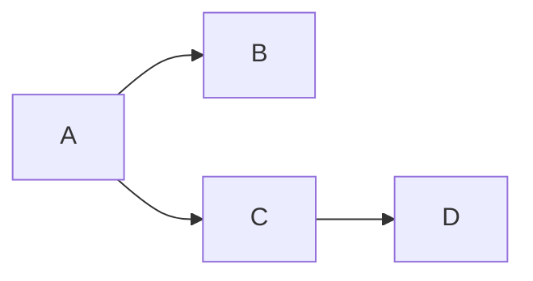

# Markdown语法

## Mermaid

github上markdown文件支持[mermaid](https://github.com/mermaid-js/mermaid)。可方便渲染各种流程图。

## Emoji

github上markdown文件支持[emoji]](https://github.com/ikatyang/emoji-cheat-sheet/blob/master/README.md#table-of-contents)。

|    :smile:    | :ok_hand:  |     :v:      |
| :-----------: | :--------: | :----------: |
| :point_right: | :point_up: | :point_left: |
|     :+1:      |    :-1:    |    :star:    |